# System Architecture Diagrams

Three-level architectural map of the GPS-free UAV localisation project. Every
diagram has explicit **Input** boundary at the top, **Output** boundary at the
bottom, and labelled arrows for every data flow in between. Each block
referencing a deeper view is annotated with `see <file>` — treat that as a
pointer in code: chase it for detail or stay at the higher level.

Every Python file is defined explicitly: the L2 diagrams show every `.py` file
as its own node, and the **File-by-file definitions** sections describe each
file's role, primary classes/functions and inputs/outputs. Pure debug, plotting,
and analysis-only files are excluded — they live under
`Pipeline_3_Rev1/analysis/` and `Pipeline_3_Rev1/tests/`.

## Index

| File | Level | Parent | Scope |
|------|-------|--------|-------|
| [`00_system_overview.mmd`](00_system_overview.mmd) | L1 | — | Three subsystems + every external input and output |
| [`01_dataset_preprocessing.mmd`](01_dataset_preprocessing.mmd) | L2 | L1 | `Dataset_Preprocessing/` — every file as a node |
| [`02_semantic_training.mmd`](02_semantic_training.mmd) | L2 | L1 | `SemanticTerrainSegmentationModel/` — notebook + artefacts |
| [`03_visual_localization.mmd`](03_visual_localization.mmd) | L2 | L1 | `Pipeline_3_Rev1/` — all 17 `.py` files in subgraphs |
| [`11_dp_qgis_workflow.mmd`](11_dp_qgis_workflow.mmd) | L3 | L2-DP | QGIS manual stage (external) |
| [`12_dp_semantic_prediction.mmd`](12_dp_semantic_prediction.mmd) | L3 | L2-DP | `semantic_preprocessor.py` internals |
| [`13_dp_superpoint_extraction.mmd`](13_dp_superpoint_extraction.mmd) | L3 | L2-DP | `superpoint_preprocessor.py` + `feature_store.py` |
| [`21_st_data_pipeline.mmd`](21_st_data_pipeline.mmd) | L3 | L2-ST | `SeasonCurriculumDataset` + augmentation + DataLoader |
| [`22_st_model_architecture.mmd`](22_st_model_architecture.mmd) | L3 | L2-ST | UNet++ / EfficientNet-B3 / scSE + freeze controller |
| [`23_st_loss_optimiser.mmd`](23_st_loss_optimiser.mmd) | L3 | L2-ST | Composite loss + AdamW + cosine LR |
| [`24_st_training_validation.mmd`](24_st_training_validation.mmd) | L3 | L2-ST | Training loop + triple validation + checkpoint |
| [`31_vl_input_bootstrap.mmd`](31_vl_input_bootstrap.mmd) | L3 | L2-VL | Input layer + EKF bootstrap (incl. **initial GPS prior**) |
| [`32_vl_ekf_state.mmd`](32_vl_ekf_state.mmd) | L3 | L2-VL | 10D Error-State EKF per-row update |
| [`33_vl_frame_dispatch.mmd`](33_vl_frame_dispatch.mmd) | L3 | L2-VL | TemporalSearcher + BFS / PF / MetaTileBuilder |
| [`34_vl_visual_matching.mmd`](34_vl_visual_matching.mmd) | L3 | L2-VL | Image preproc + SP+LG + dual homography + cascade |
| [`35_vl_semantic_gate.mmd`](35_vl_semantic_gate.mmd) | L3 | L2-VL | Semantic prefilter + confirmation |
| [`36_vl_fusion_output.mmd`](36_vl_fusion_output.mmd) | L3 | L2-VL | Quality gate + look-ahead + adaptive R + outputs |

---

## §1  System overview  (L1)

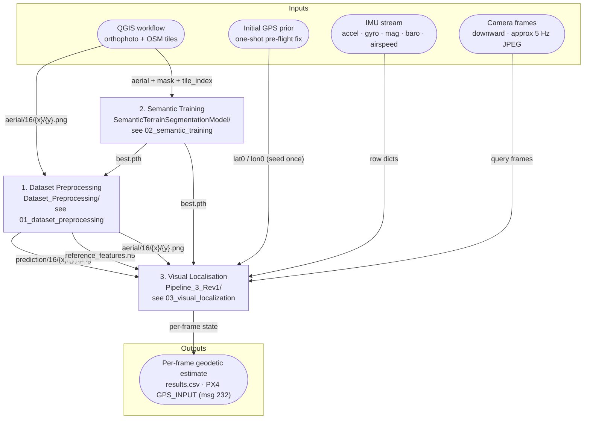
```mermaid
flowchart TD

    subgraph IN["Inputs"]
        QGIS(["QGIS workflow<br/>orthophoto + OSM tiles"])
        GPS0(["Initial GPS prior<br/>one-shot pre-flight fix"])
        IMU(["IMU stream<br/>accel · gyro · mag · baro · airspeed"])
        CAM(["Camera frames<br/>downward · approx 5 Hz JPEG"])
    end

    S1["1. Dataset Preprocessing<br/>Dataset_Preprocessing/<br/>see 01_dataset_preprocessing"]
    S2["2. Semantic Training<br/>SemanticTerrainSegmentationModel/<br/>see 02_semantic_training"]
    S3["3. Visual Localisation<br/>Pipeline_3_Rev1/<br/>see 03_visual_localization"]

    subgraph OUT_GRP["Outputs"]
        OUT(["Per-frame geodetic estimate<br/>results.csv · PX4 GPS_INPUT (msg 232)"])
    end

    QGIS -->|"aerial/16/{x}/{y}.png"| S1
    QGIS -->|"aerial + mask + tile_index"| S2

    S2 -->|"best.pth"| S1
    S2 -->|"best.pth"| S3

    S1 -->|"prediction/16/{x}/{y}.png"| S3
    S1 -->|"reference_features.h5"| S3
    S1 -->|"aerial/16/{x}/{y}.png"| S3

    GPS0 -->|"lat0 / lon0 (seed once)"| S3
    IMU -->|"row dicts"| S3
    CAM -->|"query frames"| S3

    S3 -->|"per-frame state"| OUT
```

Read the inputs, then each subsystem. The **initial GPS prior** is a single
GPS fix used only to seed the EKF origin `(lat0, lon0)` and the initial
position covariance — after the seed, GPS is never read again. Source depends
on run mode:

- *File mode* — read from row 0 of the recorded IMU CSV.
- *SimConnect (live) mode* — wait until the first SimConnect sample with
  `abs(latitude) > 1.0` arrives, then bootstrap.

The IMU stream drives `step_ekf()` continuously inside subsystem 3; the camera
frames drive `TemporalSearcher.process_frame()`; once a per-frame visual fix
passes the quality gate it is fed back to the EKF as a Kalman position update.
Each subsystem expands to its own L2 diagram (links shown inside the block).

---

## §2  Dataset Preprocessing  —  `Dataset_Preprocessing/`

### §2.1  L2 overview — file by file

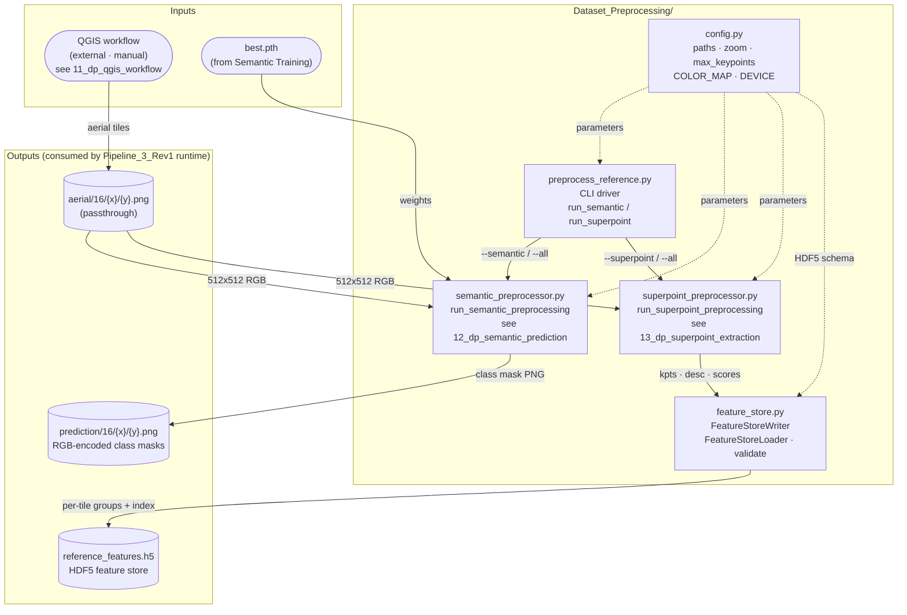
```mermaid
flowchart TD

    subgraph IN["Inputs"]
        QGIS(["QGIS workflow<br/>(external · manual)<br/>see 11_dp_qgis_workflow"])
        BPTH_IN(["best.pth<br/>(from Semantic Training)"])
    end

    subgraph CODE["Dataset_Preprocessing/"]
        CFG["config.py<br/>paths · zoom · max_keypoints<br/>COLOR_MAP · DEVICE"]
        CLI["preprocess_reference.py<br/>CLI driver<br/>run_semantic / run_superpoint"]
        SP["semantic_preprocessor.py<br/>run_semantic_preprocessing<br/>see 12_dp_semantic_prediction"]
        SUP["superpoint_preprocessor.py<br/>run_superpoint_preprocessing<br/>see 13_dp_superpoint_extraction"]
        FS["feature_store.py<br/>FeatureStoreWriter<br/>FeatureStoreLoader · validate"]
    end

    subgraph OUT_GRP["Outputs (consumed by Pipeline_3_Rev1 runtime)"]
        AER_OUT[("aerial/16/{x}/{y}.png<br/>(passthrough)")]
        PRED_OUT[("prediction/16/{x}/{y}.png<br/>RGB-encoded class masks")]
        H5_OUT[("reference_features.h5<br/>HDF5 feature store")]
    end

    QGIS -->|"aerial tiles"| AER_OUT

    CFG -.->|"parameters"| CLI
    CFG -.->|"parameters"| SP
    CFG -.->|"parameters"| SUP
    CFG -.->|"HDF5 schema"| FS

    CLI -->|"--semantic / --all"| SP
    CLI -->|"--superpoint / --all"| SUP

    AER_OUT -->|"512x512 RGB"| SP
    AER_OUT -->|"512x512 RGB"| SUP

    BPTH_IN -->|"weights"| SP

    SP -->|"class mask PNG"| PRED_OUT

    SUP -->|"kpts · desc · scores"| FS
    FS -->|"per-tile groups + index"| H5_OUT
```

### §2.2  File-by-file definitions

**`Dataset_Preprocessing/config.py`** — Single source of truth for every path
and parameter shared by the offline preprocessors. Defines
`REFERENCE_AERIAL_DIR`, `REFERENCE_PREDICTION_DIR`, `REFERENCE_FEATURES_PATH`,
`SEMANTIC_MODEL_PATH`, `TMS_ZOOM_LEVEL = 16`, `MAX_NUM_KEYPOINTS = 2048`,
`DESCRIPTOR_DTYPE`, `DEVICE`, `COLOR_MAP`, `SEMANTIC_CLASSES`. Read by every
other file in the package.
*Inputs:* — *Outputs:* parameter values consumed by the other modules.

**`Dataset_Preprocessing/preprocess_reference.py`** — CLI orchestrator.
Argparse exposes `--all / --semantic / --superpoint` (mutually exclusive,
required), `--force`, plus path overrides. Calls `run_semantic(args)` and/or
`run_superpoint(args)` and prints summary stats.
*Inputs:* CLI args. *Outputs:* dispatches into `semantic_preprocessor.py`
and/or `superpoint_preprocessor.py`.

**`Dataset_Preprocessing/semantic_preprocessor.py`** — Walks every reference
aerial tile, ImageNet-normalises, runs UNet++ inference (loaded from
`best.pth`), takes argmax over the 6 class channels and writes an RGB-encoded
class-mask PNG. Public function `run_semantic_preprocessing()`; helpers
`_load_semantic_model`, `_preprocess_tile`, `_decode_segmap`,
`_discover_tiles`. Skips tiles whose output already exists unless `--force`.
*Inputs:* `aerial/16/{x}/{y}.png`, `best.pth`. *Outputs:*
`prediction/16/{x}/{y}.png`. Internals → `12_dp_semantic_prediction`.

**`Dataset_Preprocessing/superpoint_preprocessor.py`** — Walks every reference
aerial tile, converts to grayscale, runs `lightglue.SuperPoint.extract()`
(max 2048 keypoints) and streams keypoints, descriptors and scores into the
HDF5 feature store via `FeatureStoreWriter`. Public function
`run_superpoint_preprocessing()`; helpers `_to_tensor_gray`,
`_discover_tiles`.
*Inputs:* `aerial/16/{x}/{y}.png`. *Outputs:* writes into
`reference_features.h5` via `feature_store.py`. Internals →
`13_dp_superpoint_extraction`.

**`Dataset_Preprocessing/feature_store.py`** — On-disk HDF5 schema + access
classes:
- `FeatureStoreWriter` — `open()`, `write_tile(tx, ty, kpts, desc, scores,
  image_size)`, `close()`. Writes `metadata/`, `tiles/{tx}_{ty}/` groups
  (`keypoints (N, 2)`, `descriptors (N, 256)`, `scores (N,)`) and an
  `index/` group of three parallel arrays for fast iteration.
- `FeatureStoreLoader` (consumed at runtime by `Pipeline_3_Rev1`) —
  `open()`, `has_tile(tx, ty)`, `get_features(tx, ty)`. Returns PyTorch
  tensors ready to feed straight into LightGlue.
- `validate_feature_store(path)` — sample-probe integrity check.

*Inputs:* per-tile arrays from `superpoint_preprocessor.py`. *Outputs:*
`reference_features.h5`.

### §2.3  L3 — QGIS workflow  *(external · manual stage)*

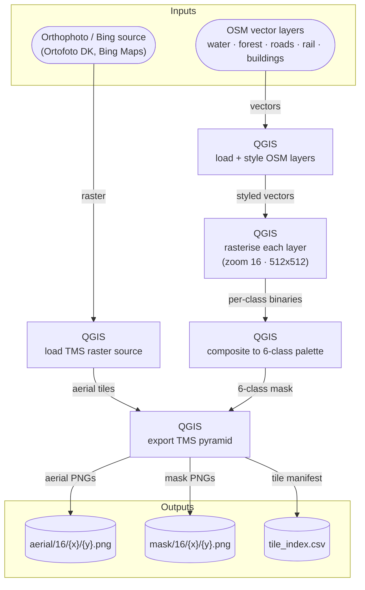
```mermaid
flowchart TD

    subgraph IN["Inputs"]
        SRC(["Orthophoto / Bing source<br/>(Ortofoto DK, Bing Maps)"])
        OSM(["OSM vector layers<br/>water · forest · roads · rail · buildings"])
    end

    Q1["QGIS<br/>load TMS raster source"]
    Q2["QGIS<br/>load + style OSM layers"]
    Q3["QGIS<br/>rasterise each layer<br/>(zoom 16 · 512x512)"]
    Q4["QGIS<br/>composite to 6-class palette"]
    Q5["QGIS<br/>export TMS pyramid"]

    subgraph OUT_GRP["Outputs"]
        AER[("aerial/16/{x}/{y}.png")]
        MSK[("mask/16/{x}/{y}.png")]
        IDX[("tile_index.csv")]
    end

    SRC -->|"raster"| Q1
    OSM -->|"vectors"| Q2
    Q2 -->|"styled vectors"| Q3
    Q3 -->|"per-class binaries"| Q4
    Q1 -->|"aerial tiles"| Q5
    Q4 -->|"6-class mask"| Q5
    Q5 -->|"aerial PNGs"| AER
    Q5 -->|"mask PNGs"| MSK
    Q5 -->|"tile manifest"| IDX
```

This stage is described, not coded in the repository. Aerial imagery is
fetched into QGIS via a TMS raster source; OSM layers are loaded, styled,
rasterised at the same TMS grid, and composited into a 6-class palette PNG.
QGIS exports the TMS pyramid for both the aerial and mask sides.

### §2.4  L3 — Semantic prediction  (`semantic_preprocessor.py`)

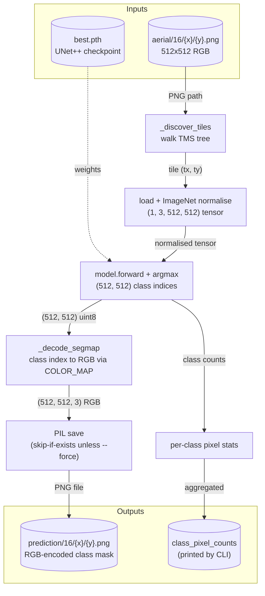
```mermaid
flowchart TD

    subgraph IN["Inputs"]
        AER_IN[("aerial/16/{x}/{y}.png<br/>512x512 RGB")]
        BPTH_IN[("best.pth<br/>UNet++ checkpoint")]
    end

    DISC["_discover_tiles<br/>walk TMS tree"]
    LOAD["load + ImageNet normalise<br/>(1, 3, 512, 512) tensor"]
    FWD["model.forward + argmax<br/>(512, 512) class indices"]
    ENC["_decode_segmap<br/>class index to RGB via COLOR_MAP"]
    SAVE["PIL save<br/>(skip-if-exists unless --force)"]
    STAT["per-class pixel stats"]

    subgraph OUT_GRP["Outputs"]
        PRED_OUT[("prediction/16/{x}/{y}.png<br/>RGB-encoded class mask")]
        STATS_OUT[("class_pixel_counts<br/>(printed by CLI)")]
    end

    AER_IN -->|"PNG path"| DISC
    DISC -->|"tile (tx, ty)"| LOAD
    BPTH_IN -.->|"weights"| FWD
    LOAD -->|"normalised tensor"| FWD
    FWD -->|"(512, 512) uint8"| ENC
    ENC -->|"(512, 512, 3) RGB"| SAVE
    SAVE -->|"PNG file"| PRED_OUT
    FWD -->|"class counts"| STAT
    STAT -->|"aggregated"| STATS_OUT
```

### §2.5  L3 — SuperPoint extraction + feature store

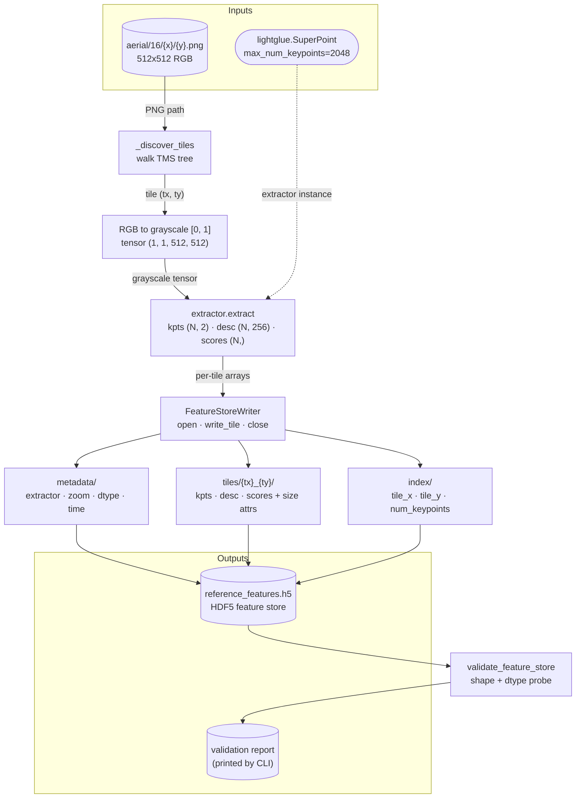
```mermaid
flowchart TD

    subgraph IN["Inputs"]
        AER_IN[("aerial/16/{x}/{y}.png<br/>512x512 RGB")]
        EXT_IN(["lightglue.SuperPoint<br/>max_num_keypoints=2048"])
    end

    DISC["_discover_tiles<br/>walk TMS tree"]
    GREY["RGB to grayscale [0, 1]<br/>tensor (1, 1, 512, 512)"]
    EXT["extractor.extract<br/>kpts (N, 2) · desc (N, 256) · scores (N,)"]

    FW["FeatureStoreWriter<br/>open · write_tile · close"]
    META["metadata/<br/>extractor · zoom · dtype · time"]
    TILES["tiles/{tx}_{ty}/<br/>kpts · desc · scores + size attrs"]
    INDEX["index/<br/>tile_x · tile_y · num_keypoints"]
    VAL["validate_feature_store<br/>shape + dtype probe"]

    subgraph OUT_GRP["Outputs"]
        H5_OUT[("reference_features.h5<br/>HDF5 feature store")]
        VAL_OUT[("validation report<br/>(printed by CLI)")]
    end

    AER_IN -->|"PNG path"| DISC
    DISC -->|"tile (tx, ty)"| GREY
    GREY -->|"grayscale tensor"| EXT
    EXT_IN -.->|"extractor instance"| EXT
    EXT -->|"per-tile arrays"| FW

    FW --> META
    FW --> TILES
    FW --> INDEX

    META --> H5_OUT
    TILES --> H5_OUT
    INDEX --> H5_OUT
    H5_OUT --> VAL
    VAL --> VAL_OUT
```

---

## §3  Semantic Training  —  `SemanticTerrainSegmentationModel/`

### §3.1  L2 overview — file by file

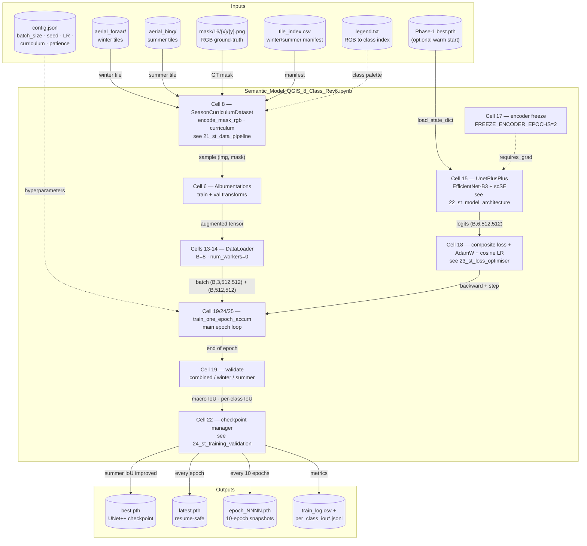
```mermaid
flowchart TD

    subgraph IN["Inputs"]
        AER_F[("aerial_foraar/<br/>winter tiles")]
        AER_S[("aerial_bing/<br/>summer tiles")]
        MASK[("mask/16/{x}/{y}.png<br/>RGB ground-truth")]
        IDX[("tile_index.csv<br/>winter/summer manifest")]
        CFGJ[("config.json<br/>batch_size · seed · LR ·<br/>curriculum · patience")]
        LEG[("legend.txt<br/>RGB to class index")]
        WARM[("Phase-1 best.pth<br/>(optional warm start)")]
    end

    subgraph NB["Semantic_Model_QGIS_8_Class_Rev6.ipynb"]
        DATA["Cell 8 — SeasonCurriculumDataset<br/>encode_mask_rgb · curriculum<br/>see 21_st_data_pipeline"]
        AUG["Cell 6 — Albumentations<br/>train + val transforms"]
        DL["Cells 13-14 — DataLoader<br/>B=8 · num_workers=0"]
        MOD["Cell 15 — UnetPlusPlus<br/>EfficientNet-B3 + scSE<br/>see 22_st_model_architecture"]
        FREEZE["Cell 17 — encoder freeze<br/>FREEZE_ENCODER_EPOCHS=2"]
        LOSS["Cell 18 — composite loss + AdamW + cosine LR<br/>see 23_st_loss_optimiser"]
        TRAIN["Cell 19/24/25 — train_one_epoch_accum<br/>main epoch loop"]
        VAL["Cell 19 — validate<br/>combined / winter / summer"]
        CKPT["Cell 22 — checkpoint manager<br/>see 24_st_training_validation"]
    end

    subgraph OUT_GRP["Outputs"]
        BEST[("best.pth<br/>UNet++ checkpoint")]
        LATEST[("latest.pth<br/>resume-safe")]
        SNAP[("epoch_NNNN.pth<br/>10-epoch snapshots")]
        LOG[("train_log.csv +<br/>per_class_iou*.jsonl")]
    end

    AER_F -->|"winter tile"| DATA
    AER_S -->|"summer tile"| DATA
    MASK -->|"GT mask"| DATA
    IDX -->|"manifest"| DATA
    LEG -.->|"class palette"| DATA
    CFGJ -.->|"hyperparameters"| TRAIN

    DATA -->|"sample (img, mask)"| AUG
    AUG -->|"augmented tensor"| DL
    DL -->|"batch (B,3,512,512) + (B,512,512)"| TRAIN

    WARM -->|"load_state_dict"| MOD
    MOD -->|"logits (B,6,512,512)"| LOSS
    FREEZE -.->|"requires_grad"| MOD
    LOSS -->|"backward + step"| TRAIN

    TRAIN -->|"end of epoch"| VAL
    VAL -->|"macro IoU · per-class IoU"| CKPT

    CKPT -->|"every epoch"| LATEST
    CKPT -->|"summer IoU improved"| BEST
    CKPT -->|"every 10 epochs"| SNAP
    CKPT -->|"metrics"| LOG
```

### §3.2  File-by-file definitions

**`Semantic_Model_QGIS_8_Class_Rev6.ipynb`** — Canonical Phase-2 (curriculum
fine-tuning) training notebook. Self-contained: imports, configuration,
`SeasonCurriculumDataset` definition, augmentation pipeline, DataLoader
instantiation, model construction with optional warm start, encoder freeze
controller, composite loss, AdamW + cosine LR, AMP-enabled training step,
triple-validator (combined / winter / summer), checkpoint manager and per-
epoch CSV / JSONL logging. Cell numbers are referenced in the L2 diagram.
*Inputs:* aerial + mask tiles, manifest, `config.json`, `legend.txt`,
optional warm-start `best.pth`. *Outputs:* `best.pth`, `latest.pth`,
`epoch_NNNN.pth`, `train_log.csv`, `per_class_iou*.jsonl`.

**`config.json`** — Persistent hyperparameter store: `batch_size=8`,
`seed=42`, `val_every=1`, `patience`, `min_delta`,
`freeze_encoder_epochs=2`, `finetune_lr_encoder=1e-4`,
`finetune_lr_decoder=5e-4`, `cosine_t_max=25`, `cosine_eta_min=1e-6`,
season-curriculum schedule.
*Inputs:* — *Outputs:* hyperparameter dict consumed by the notebook.

**`legend.txt`** — RGB → class-index map for the 6-class palette
(waterbodies, forest, land, railway, roads, buildings). Read by
`encode_mask_rgb` during dataset construction.
*Inputs:* — *Outputs:* class palette dict.

**`best.pth` (Phase-1, winter-only)** — Optional warm-start checkpoint. When
present, its `model_state_dict` is loaded into the Phase-2 UNet++ at
construction time so the curriculum fine-tune starts from a winter-trained
baseline rather than ImageNet alone.
*Inputs:* — *Outputs:* model state dict for warm start.

### §3.3  L3 — Data pipeline

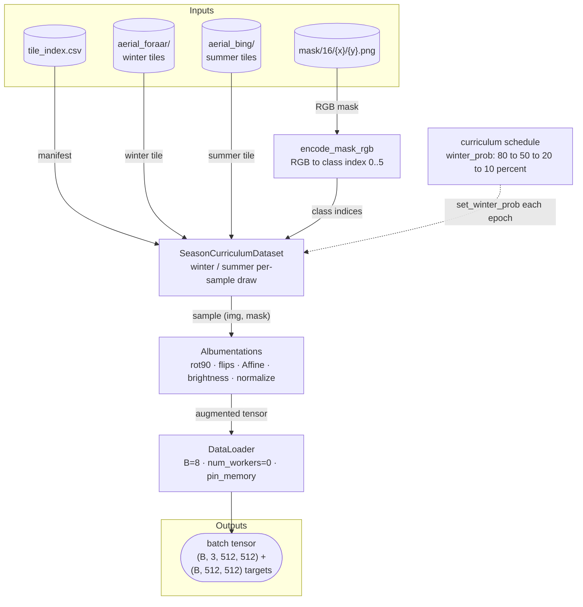
```mermaid
flowchart TD

    subgraph IN["Inputs"]
        IDX_IN[("tile_index.csv")]
        WIN_IN[("aerial_foraar/<br/>winter tiles")]
        SUM_IN[("aerial_bing/<br/>summer tiles")]
        MASK_IN[("mask/16/{x}/{y}.png")]
    end

    DS["SeasonCurriculumDataset<br/>winter / summer per-sample draw"]
    EM["encode_mask_rgb<br/>RGB to class index 0..5"]
    CURR["curriculum schedule<br/>winter_prob: 80 to 50 to 20 to 10 percent"]
    AUG["Albumentations<br/>rot90 · flips · Affine · brightness · normalize"]
    DL["DataLoader<br/>B=8 · num_workers=0 · pin_memory"]

    subgraph OUT_GRP["Outputs"]
        BATCH_OUT(["batch tensor<br/>(B, 3, 512, 512) +<br/>(B, 512, 512) targets"])
    end

    IDX_IN -->|"manifest"| DS
    WIN_IN -->|"winter tile"| DS
    SUM_IN -->|"summer tile"| DS
    MASK_IN -->|"RGB mask"| EM
    EM -->|"class indices"| DS
    CURR -.->|"set_winter_prob each epoch"| DS

    DS -->|"sample (img, mask)"| AUG
    AUG -->|"augmented tensor"| DL
    DL --> BATCH_OUT
```

### §3.4  L3 — Model architecture

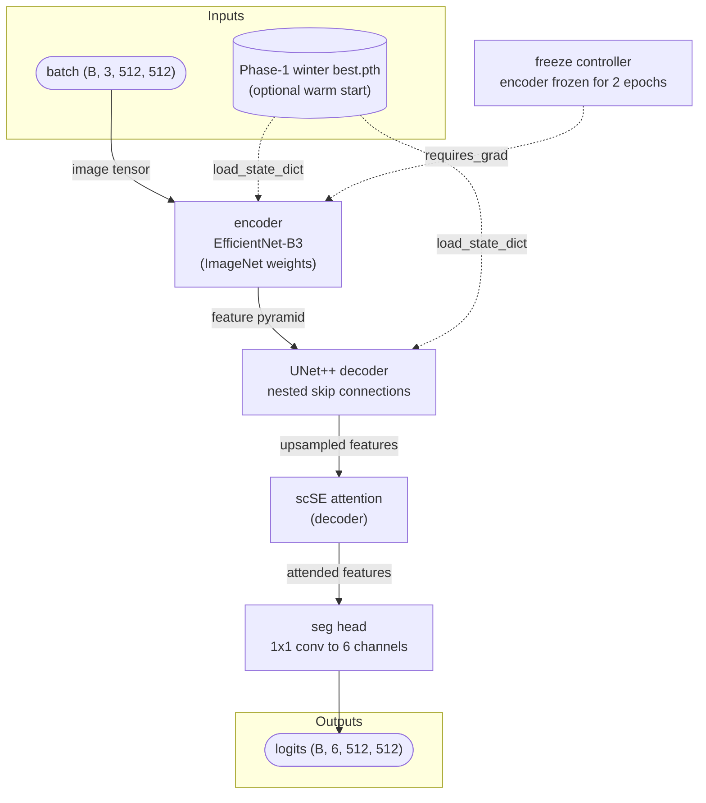
```mermaid
flowchart TD

    subgraph IN["Inputs"]
        IN_BATCH(["batch (B, 3, 512, 512)"])
        WARM_IN[("Phase-1 winter best.pth<br/>(optional warm start)")]
    end

    ENC["encoder<br/>EfficientNet-B3<br/>(ImageNet weights)"]
    DEC["UNet++ decoder<br/>nested skip connections"]
    ATT["scSE attention<br/>(decoder)"]
    HEAD["seg head<br/>1x1 conv to 6 channels"]
    FREEZE["freeze controller<br/>encoder frozen for 2 epochs"]

    subgraph OUT_GRP["Outputs"]
        OUT_LOG(["logits (B, 6, 512, 512)"])
    end

    IN_BATCH -->|"image tensor"| ENC
    ENC -->|"feature pyramid"| DEC
    DEC -->|"upsampled features"| ATT
    ATT -->|"attended features"| HEAD
    HEAD --> OUT_LOG

    WARM_IN -.->|"load_state_dict"| ENC
    WARM_IN -.->|"load_state_dict"| DEC
    FREEZE -.->|"requires_grad"| ENC
```

### §3.5  L3 — Loss + optimiser + scheduler

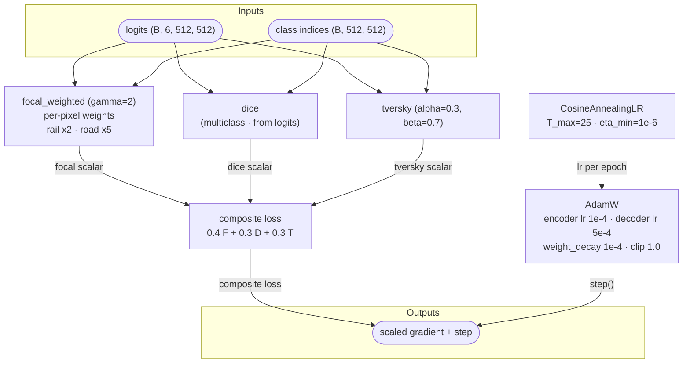
```mermaid
flowchart TD

    subgraph IN["Inputs"]
        LG_IN(["logits (B, 6, 512, 512)"])
        GT_IN(["class indices (B, 512, 512)"])
    end

    F["focal_weighted (gamma=2)<br/>per-pixel weights<br/>rail x2 · road x5"]
    D["dice<br/>(multiclass · from logits)"]
    T["tversky (alpha=0.3, beta=0.7)"]
    SUM["composite loss<br/>0.4 F + 0.3 D + 0.3 T"]
    OPT["AdamW<br/>encoder lr 1e-4 · decoder lr 5e-4<br/>weight_decay 1e-4 · clip 1.0"]
    SCH["CosineAnnealingLR<br/>T_max=25 · eta_min=1e-6"]

    subgraph OUT_GRP["Outputs"]
        BACK_OUT(["scaled gradient + step"])
    end

    LG_IN --> F
    LG_IN --> D
    LG_IN --> T
    GT_IN --> F
    GT_IN --> D
    GT_IN --> T

    F -->|"focal scalar"| SUM
    D -->|"dice scalar"| SUM
    T -->|"tversky scalar"| SUM

    SUM -->|"composite loss"| BACK_OUT
    OPT -->|"step()"| BACK_OUT
    SCH -.->|"lr per epoch"| OPT
```

### §3.6  L3 — Training loop + triple validation + checkpoint

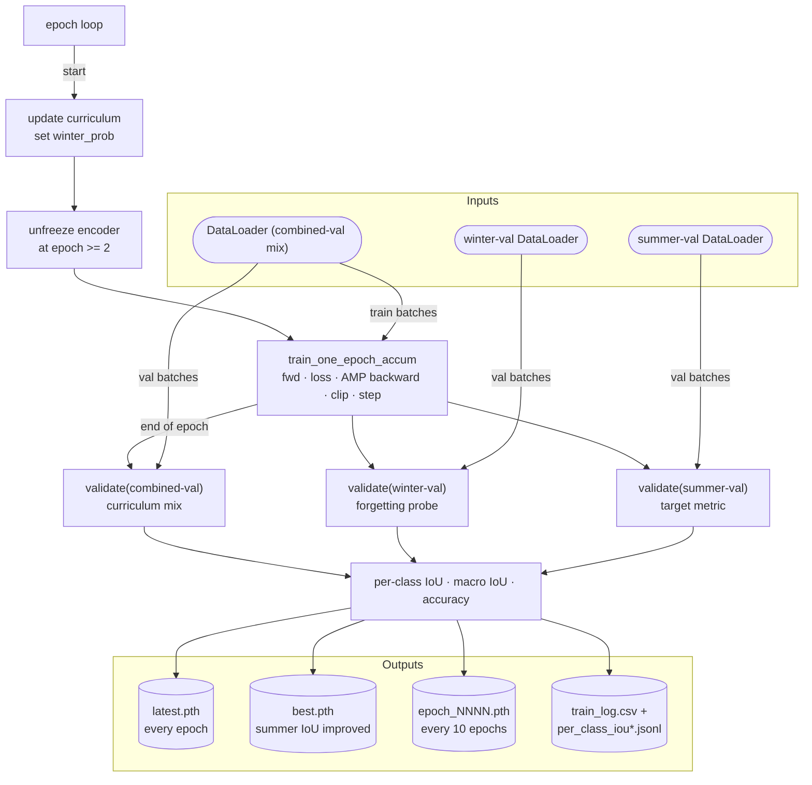
```mermaid
flowchart TD

    subgraph IN["Inputs"]
        DL_IN(["DataLoader (combined-val mix)"])
        WIN_IN(["winter-val DataLoader"])
        SUM_IN(["summer-val DataLoader"])
    end

    EPOCH["epoch loop"]
    UPD_CURR["update curriculum<br/>set winter_prob"]
    UNFREEZE["unfreeze encoder<br/>at epoch >= 2"]
    STEP["train_one_epoch_accum<br/>fwd · loss · AMP backward · clip · step"]

    VC["validate(combined-val)<br/>curriculum mix"]
    VW["validate(winter-val)<br/>forgetting probe"]
    VS["validate(summer-val)<br/>target metric"]

    METRIC["per-class IoU · macro IoU · accuracy"]

    subgraph OUT_GRP["Outputs"]
        LATEST_OUT[("latest.pth<br/>every epoch")]
        BEST_OUT[("best.pth<br/>summer IoU improved")]
        SNAP_OUT[("epoch_NNNN.pth<br/>every 10 epochs")]
        LOG_OUT[("train_log.csv +<br/>per_class_iou*.jsonl")]
    end

    EPOCH -->|"start"| UPD_CURR
    UPD_CURR --> UNFREEZE
    UNFREEZE --> STEP
    DL_IN -->|"train batches"| STEP

    STEP -->|"end of epoch"| VC
    STEP --> VW
    STEP --> VS
    DL_IN -->|"val batches"| VC
    WIN_IN -->|"val batches"| VW
    SUM_IN -->|"val batches"| VS

    VC --> METRIC
    VW --> METRIC
    VS --> METRIC

    METRIC --> LATEST_OUT
    METRIC --> BEST_OUT
    METRIC --> SNAP_OUT
    METRIC --> LOG_OUT
```

---

## §4  Visual Localisation Pipeline  —  `Pipeline_3_Rev1/`

### §4.1  L2 overview — file by file

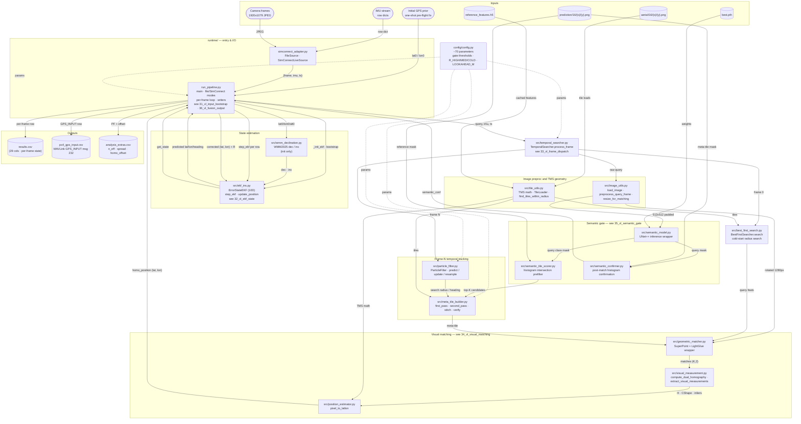
```mermaid
flowchart TD

    subgraph IN["Inputs"]
        GPS0(["Initial GPS prior<br/>one-shot pre-flight fix"])
        IMU(["IMU stream<br/>row dicts"])
        CAM(["Camera frames<br/>1920x1079 JPEG"])
        REF_AER[("aerial/16/{x}/{y}.png")]
        REF_PRED[("prediction/16/{x}/{y}.png")]
        REF_H5[("reference_features.h5")]
        REF_PTH[("best.pth")]
    end

    subgraph IO_GRP["runtime/ — entry & I/O"]
        RP["run_pipeline.py<br/>main · file/SimConnect modes<br/>per-frame loop · writers<br/>see 31_vl_input_bootstrap · 36_vl_fusion_output"]
        SCA["simconnect_adapter.py<br/>FileSource · SimConnectLiveSource"]
    end

    subgraph EKF_GRP["State estimation"]
        EKF["src/ekf_ins.py<br/>ErrorStateEKF (10D)<br/>step_ekf · update_position<br/>see 32_vl_ekf_state"]
        WMM["src/wmm_declination.py<br/>WMM2025 dec / inc<br/>(init only)"]
    end

    TS["src/temporal_searcher.py<br/>TemporalSearcher.process_frame<br/>see 33_vl_frame_dispatch"]

    BFS["src/best_first_search.py<br/>BestFirstSearcher.search<br/>cold-start radius search"]

    subgraph FN_GRP["Frame-N temporal tracking"]
        PF["src/particle_filter.py<br/>ParticleFilter · predict / update / resample"]
        MTB["src/meta_tile_builder.py<br/>first_pass · second_pass · stitch · verify"]
    end

    subgraph GEOM_GRP["Image preproc and TMS geometry"]
        IU["src/image_utils.py<br/>load_image · preprocess_query_frame ·<br/>resize_for_matching"]
        TU["src/tile_utils.py<br/>TMS math · TileLoader ·<br/>find_tiles_within_radius"]
    end

    subgraph MATCH_GRP["Visual matching — see 34_vl_visual_matching"]
        GM["src/geometric_matcher.py<br/>SuperPoint + LightGlue wrapper"]
        VM["src/visual_measurement.py<br/>compute_dual_homography ·<br/>extract_visual_measurements"]
        PE["src/position_estimator.py<br/>pixel_to_latlon"]
    end

    subgraph SEM_GRP["Semantic gate — see 35_vl_semantic_gate"]
        SM["src/semantic_model.py<br/>UNet++ inference wrapper"]
        STS["src/semantic_tile_scorer.py<br/>histogram intersection prefilter"]
        SC["src/semantic_confirmer.py<br/>post-match histogram confirmation"]
    end

    CFG["config/config.py<br/>~70 parameters<br/>gate thresholds · R_HIGH/MED/COLD · LOOKAHEAD_M"]

    subgraph OUT_GRP["Outputs"]
        CSV[("results.csv<br/>(29 cols · per-frame state)")]
        PX4[("px4_gps_input.csv<br/>MAVLink GPS_INPUT msg 232")]
        EXTRA[("analysis_extras.csv<br/>n_eff · spread · homo_offset")]
    end

    GPS0 -->|"lat0 / lon0"| RP
    IMU -->|"row dict"| SCA
    CAM -->|"JPEG"| SCA
    SCA -->|"(frame, imu, ts)"| RP

    CFG -.->|"params"| RP
    CFG -.->|"params"| TS
    CFG -.->|"params"| MTB
    CFG -.->|"params"| PF

    RP -->|"_init_ekf · bootstrap"| EKF
    RP -->|"lat0/lon0/alt0"| WMM
    WMM -->|"dec · inc"| EKF
    RP -->|"step_ekf per row"| EKF
    EKF -->|"predicted lat/lon/heading"| RP

    RP -->|"query, imu, ts"| TS
    TS -->|"frame 0"| BFS
    TS -->|"frame N"| PF
    TS -->|"raw query"| IU
    IU -->|"rotated 1280px"| GM
    IU -->|"512x512 padded"| SM

    REF_PTH -->|"weights"| SM
    SM -->|"query class mask"| STS
    REF_PRED -->|"reference mask"| STS
    STS -->|"top-K candidates"| MTB

    PF -->|"search radius / heading"| MTB
    REF_AER -->|"tile loads"| TU
    REF_H5 -->|"cached features"| TU
    TU -->|"tiles"| BFS
    TU -->|"tiles"| MTB
    BFS -->|"query feats"| GM
    MTB -->|"meta-tile"| GM

    GM -->|"matches (K,2)"| VM
    VM -->|"H · CShape · inliers"| PE
    PE -->|"homo_position (lat, lon)"| RP
    TU -->|"TMS math"| PE

    SM -->|"query mask"| SC
    REF_PRED -->|"meta-tile mask"| SC
    SC -->|"semantic_conf"| RP

    RP -->|"corrected (lat, lon) + R"| EKF
    EKF -->|"get_state"| RP

    RP -->|"per-frame row"| CSV
    RP -->|"GPS_INPUT row"| PX4
    RP -->|"PF + offset"| EXTRA
```

### §4.2  File-by-file definitions  (all 17 `.py` files)

#### `runtime/`

**`runtime/run_pipeline.py`** — Main CLI entry. Parses
`--source file|simconnect`, `--imu-csv`, `--frames-dir`, `--run-id`,
`--start-row`, `--max-frames`, `--debug`. Sets up the run directory, calls
`_init_models()` (semantic model, SP+LG matcher, `TileLoader`,
`FeatureStoreLoader`), instantiates `TemporalSearcher`, then dispatches to
`run_file_mode` or `run_simconnect_mode`. The per-frame helper
`_process_one_frame` runs `step_ekf` → builds `imu_data` → calls
`searcher.process_frame` → applies the look-ahead correction → computes
adaptive R → calls `ekf.update_position` → writes the `results.csv` row.
Constants: `LOOKAHEAD_M = 110`, `R_HIGH = 30²`, `R_MED = 60²`,
`R_COLD_START = 100²`.
*Inputs:* CLI args, IMU stream, query frames, EKF state. *Outputs:*
`results.csv`, optional `px4_gps_input.csv`, `analysis_extras.csv`.

**`runtime/simconnect_adapter.py`** — Two source classes:
- `FileSource` — replays a pre-recorded run. `iter_aligned(start_row,
  max_frames)` walks the IMU CSV and yields `(csv_idx, row_dict, timestamp,
  frame_path)` tuples for every IMU row whose timestamp matches a JPEG file
  on disk (rounded to 3 decimal places). Exposes the full `raw_df` for the
  `_init_ekf` warm-up.
- `SimConnectLiveSource` — daemon-thread SimConnect poller (~50 Hz).
  Captures screen frames at `CAPTURE_FPS=5`. Non-blocking
  `get_latest_row()` and `get_latest_frame()` keep the visual loop
  unblocked while the IMU thread runs at full rate. Implements the *unit
  contract* — knots → m/s, ft/min → m/s, ambient `BAROMETER_PRESSURE` (not
  the QNH Kohlsman dial), and trusts that `_DEGREES_` SimConnect variables
  are actually returned in radians by the Python binding.

*Inputs:* IMU CSV + JPEG dir (file mode) or SimConnect API (live mode).
*Outputs:* aligned `(query_frame, imu_row, timestamp)` tuples.

#### `src/`  (state estimation & geometry)

**`src/ekf_ins.py`** — 10D Error-State Extended Kalman Filter.
- Quaternion utilities (`quat_from_euler`, `quat_to_euler`,
  `quat_multiply`, `quat_normalize`, `quat_to_rotation_matrix`, `expq`,
  `skew`).
- `barometric_altitude(pressure_mbar)` — ISA standard formula.
- `ErrorStateEKF` — error state
  `[δθ(3), δb_g(3), δw_NE(2), δp_NE(2)]` with covariance `P (10×10)`;
  methods `predict(omega, accel_body, dt)`,
  `update_accel_mag(accel, mag_heading_deg)`, `update_barometer`,
  `update_airspeed`, `update_position(lat, lon, R_pos_m2)`,
  `get_state()`. Initial position covariance `P[8:10,8:10] = (200 m)²`.
- `step_ekf(ekf, row_dict, prev_ts)` — single-row driver: predict +
  every available sensor update.

*Inputs:* IMU row dict + visual position fixes. *Outputs:* state dict
(geodetic + Euler + NED velocity).

**`src/wmm_declination.py`** — World Magnetic Model 2025 lookup.
`get_mag_field(lat, lon, alt)` returns `(declination_deg,
inclination_deg)`. Called once at EKF construction so the magnetometer
update uses the right reference field for the flight area.
*Inputs:* `(lat, lon, alt)`. *Outputs:* `(dec_deg, inc_deg)`.

**`src/temporal_searcher.py`** — Top-level per-frame orchestrator.
`TemporalSearcher.process_frame(query_frame, imu_data, timestamp)`
dispatches `_process_frame_0` (cold start) for the first frame and
`_process_frame_N` (temporal tracking) for every subsequent frame. Owns
the live `ParticleFilter`, the `MetaTileBuilder`, the `SemanticConfirmer`
and the bifurcated query-image preprocessing.
*Inputs:* query frame, EKF prior, timestamp. *Outputs:* per-frame result
dict (homography position, gate flag, quality scores, semantic confidence,
trace data).

#### `src/`  (search & matching)

**`src/best_first_search.py`** — `BestFirstSearcher.search(query_for_match,
imu_lat, imu_lon)` runs the cold-start exhaustive search. Calls
`find_tiles_within_radius` for tiles inside ~500 m of the IMU prior, uses
`extract_features` once and `match_precomputed` per candidate, ranks by
inlier count and returns `(position, score, ranked_tiles, match_result)`.
*Inputs:* rotated query frame, IMU lat/lon. *Outputs:* ranked tiles,
match_result for the top tile.

**`src/particle_filter.py`** — Bootstrap particle filter in TMS coordinates
(`Particle` dataclass with `x`, `y`, `heading`, `weight`).
`ParticleFilter.__init__(num_particles=100, ...)`; methods
`predict(dt, vel, gyro_z_dps)`, `update(measurements)`, `resample()`
(systematic, ESS-triggered), `get_estimate()`, `get_search_region()`,
`check_divergence()`. Demoted in Phase C to **search-region guidance only**.
*Inputs:* dt, velocity, gyro_z, visual measurements. *Outputs:* search
region (radius, heading_spread), divergence flag.

**`src/meta_tile_builder.py`** — Two-pass tile search.
`MetaTileBuilder.first_pass(query_frame, imu_lat, imu_lon, search_radius_m,
query_feats, query_semantic_map)` runs SP+LG against every candidate inside
the radius (optionally pre-filtered to top-K).
`second_pass(top_tile_xy, query_feats)` expands to the 8-neighbour ring
around the top-1 hit. The top-3 tiles are stitched into a 1536×1536
meta-tile; an optional verification re-match reports
`verification_matches`.
*Inputs:* rotated query, IMU lat/lon, search radius, optional query
semantic map. *Outputs:* top-3 ranked tiles, meta-tile image,
verification flag/count.

#### `src/`  (visual matching)

**`src/geometric_matcher.py`** — Thin wrapper over LightGlue's bundled
SuperPoint + LightGlue. `initialize_matcher(device, max_keypoints)` returns
an instance with `extract_features(image)` (called once per frame and
cached), `match_precomputed(query_feats, tile_image)`, and
`match_both_precomputed(query_feats, ref_feats)` for the fast path when the
HDF5 feature store has the reference tile.
*Inputs:* query image, reference image (or precomputed reference features).
*Outputs:* `{keypoints1, keypoints2, matches (K,2), num_matches}`.

**`src/visual_measurement.py`** — Geometric measurement extraction.
- `rotate_image(image, angle_deg)` — affine rotation that preserves the
  full image (for de-yaw alignment).
- `compute_dual_homography(src_pts, dst_pts, qw, qh, ransac_thresh=8.0)`
  — fits both DLT and MAGSAC++; picks the winner by inlier count and
  CShape (inlier convex-hull convexity).
- `extract_visual_measurements(H, mask, src_pts, dst_pts, qw, qh, top3,
  pitch_rad, roll_rad)` — five candidate geodetic measurements:
  `nadir_corrected`, `trimmed_inlier`, `inlier_centroid`,
  `weighted_centroid`, `projected`. Returns the cascade and each entry's
  validity flag.

*Inputs:* query/reference image dims, matched point pairs, EKF pitch/roll,
top-3 tile coordinates. *Outputs:* winning H, inlier mask, CShape, cascade
of geodetic measurements.

**`src/position_estimator.py`** — Pixel-to-geodetic conversion.
`estimate_homography` (cv2.findHomography RANSAC),
`query_center_in_reference`, `pixel_to_latlon_in_metatile` (3×3 stitched
canvas) and `pixel_to_latlon_single_tile` (single reference tile).
*Inputs:* H, query keypoint coords, tile xy. *Outputs:* `(lat, lon)`.

#### `src/`  (geometry & I/O helpers)

**`src/image_utils.py`** — Bifurcated image preprocessing.
- `load_image(path)` — RGB read.
- `preprocess_query_frame(image, resize_w=512, resize_h=288,
  target_size=512)` — semantic path: resize to 512×288 then centre-pad to
  512×512.
- `resize_for_matching(image, max_dim)` — matching path: cap longest edge
  at `MAX_ROTATED_DIMENSION = 1280`, no padding.

*Inputs:* raw image array or path. *Outputs:* preprocessed image arrays
for the two consumer paths.

**`src/tile_utils.py`** — TMS geometry plus reference tile I/O.
- `latlon_to_tile`, `latlon_to_tile_float`, `tile_to_latlon`,
  `tile_bounds` — TMS-OSM Y-axis conversion (`y_TMS = n − 1 − y_OSM`).
- `find_tiles_within_radius(lat, lon, radius_m, zoom, x_range, y_range)`
  — candidate enumeration (haversine).
- `tile_size_meters(zoom, lat)`, `haversine_distance`.
- `TileLoader(aerial_dir, prediction_dir, zoom, x_range, y_range)` —
  `load_aerial(tx, ty)`, `load_prediction(tx, ty)`. Used by both
  `BestFirstSearcher` and `MetaTileBuilder`.

*Inputs:* geodetic coordinates and tile xy. *Outputs:* TMS coordinates,
reference tile arrays, candidate tile lists.

#### `src/`  (semantic)

**`src/semantic_model.py`** — `load_semantic_model(checkpoint_path,
device)` loads `best.pth` into a `smp.UnetPlusPlus` (encoder
`efficientnet-b3`, decoder attention `scse`, 6 classes), exposes
`predict(image_uint8_rgb) → class_mask_uint8`. ImageNet normalisation
applied internally.
*Inputs:* checkpoint path, query image. *Outputs:* 512×512 class index
mask.

**`src/semantic_tile_scorer.py`** — Pre-filter scorer.
`_rgb_to_class_mask(rgb)` decodes the colour-coded prediction PNG via
`_COLOR_TO_CLASS`. `compute_histogram_confidence(query_hist, ref_hist)`
returns the histogram-intersection ratio. Class method
`SemanticTileScorer.score_tiles(query_semantic_map, candidates,
tile_loader)` returns the candidates ranked by histogram similarity —
used by `MetaTileBuilder.first_pass` to keep only the top-K most plausible
tiles before paying the SuperPoint cost.
*Inputs:* query semantic map, candidate tile list, `TileLoader`.
*Outputs:* ranked candidates with similarity scores.

**`src/semantic_confirmer.py`** — Post-match confirmation.
`confirm(query_semantic_map, meta_tile, prediction_meta_tile)` builds the
meta-tile-sized reference class mask (decoded from `prediction_meta_tile`
if provided, else segmented live) and returns the histogram-intersection
confidence ∈ [0, 1] used to scale the EKF measurement noise.
*Inputs:* query semantic map, meta-tile reference data. *Outputs:*
`{confidence}`.

#### Configuration

**`config/config.py`** — All ~70 runtime parameters: data paths
(`IMU_CSV_PATH`, `QUERY_FRAMES_DIR`, `REFERENCE_TILES_DIR`,
`REFERENCE_PRED_DIR`, `REFERENCE_FEATURES_PATH`, `SEMANTIC_MODEL_PATH`,
`RUNS_OUTPUT_DIR`); TMS extents (`TILE_X_MIN/MAX`, `TILE_Y_MIN/MAX`,
`TMS_ZOOM_LEVEL=16`, `TMS_TILE_SIZE_PX=512`); matcher caps
(`MAX_NUM_KEYPOINTS=2048`, `MAX_ROTATED_DIMENSION=1280`); search radii
(`IMU_SEARCH_RADIUS_METERS=500`, `FIRST_PASS_SEARCH_RADIUS_M=500`);
particle counts (`NUM_PARTICLES=100`); gate thresholds
(`QUALITY_GATE_CSHAPE=0.3`, `QUALITY_GATE_INLIERS=20`,
`HIGH_QUALITY_CSHAPE=0.5`, `HIGH_QUALITY_INLIERS=100`); semantic prefilter
toggle (`SEMANTIC_PREFILTER_ENABLED`, `SEMANTIC_PREFILTER_TOP_K=10`);
output toggles (`SAVE_QUERY_FRAMES`, `SAVE_IMU_ROWS`,
`SAVE_ANALYSIS_DATA`, `SAVE_PIPELINE_TRACE`, `SAVE_TIMING_DATA`,
`DEBUG_SAVE_METATILES`, `ACCUMULATE_HISTORY`); and class-colour map shared
with the dataset preprocessor.
*Inputs:* — *Outputs:* parameter values consumed by every other module.

### §4.3  L3 — Input layer + EKF bootstrap (incl. **initial GPS prior**)

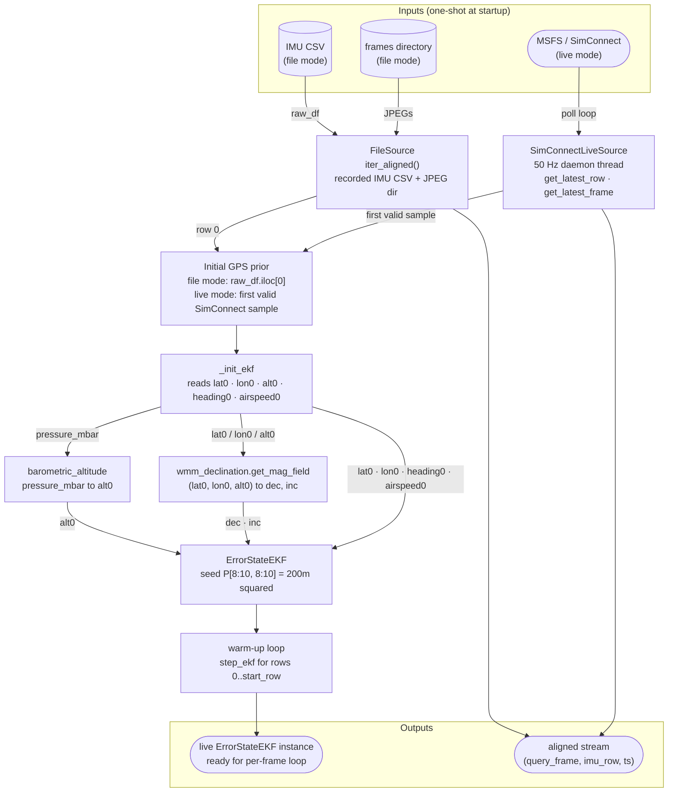
```mermaid
flowchart TD

    subgraph IN["Inputs (one-shot at startup)"]
        IMU_CSV[("IMU CSV<br/>(file mode)")]
        FRAMES_DIR[("frames directory<br/>(file mode)")]
        SIMCONN(["MSFS / SimConnect<br/>(live mode)"])
    end

    FILE["FileSource<br/>iter_aligned()<br/>recorded IMU CSV + JPEG dir"]
    LIVE["SimConnectLiveSource<br/>50 Hz daemon thread<br/>get_latest_row · get_latest_frame"]

    GPS0["Initial GPS prior<br/>file mode: raw_df.iloc[0]<br/>live mode: first valid SimConnect sample"]

    INIT["_init_ekf<br/>reads lat0 · lon0 · alt0 · heading0 · airspeed0"]
    BARO["barometric_altitude<br/>pressure_mbar to alt0"]
    WMM["wmm_declination.get_mag_field<br/>(lat0, lon0, alt0) to dec, inc"]
    EKF_NEW["ErrorStateEKF<br/>seed P[8:10, 8:10] = 200m squared"]
    WARM["warm-up loop<br/>step_ekf for rows 0..start_row"]

    subgraph OUT_GRP["Outputs"]
        OUT_EKF(["live ErrorStateEKF instance<br/>ready for per-frame loop"])
        OUT_STREAM(["aligned stream<br/>(query_frame, imu_row, ts)"])
    end

    IMU_CSV -->|"raw_df"| FILE
    FRAMES_DIR -->|"JPEGs"| FILE
    SIMCONN -->|"poll loop"| LIVE

    FILE -->|"row 0"| GPS0
    LIVE -->|"first valid sample"| GPS0
    GPS0 --> INIT
    INIT -->|"pressure_mbar"| BARO
    BARO -->|"alt0"| EKF_NEW
    INIT -->|"lat0 / lon0 / alt0"| WMM
    WMM -->|"dec · inc"| EKF_NEW
    INIT -->|"lat0 · lon0 · heading0 · airspeed0"| EKF_NEW
    EKF_NEW --> WARM
    WARM --> OUT_EKF

    FILE --> OUT_STREAM
    LIVE --> OUT_STREAM
```

### §4.4  L3 — EKF state estimation per IMU row

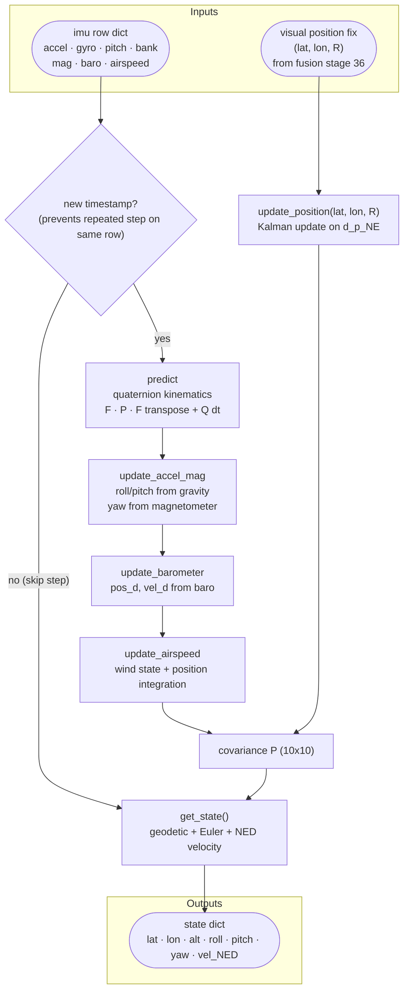
```mermaid
flowchart TD

    subgraph IN["Inputs"]
        ROW_IN(["imu row dict<br/>accel · gyro · pitch · bank<br/>mag · baro · airspeed"])
        VPOS_IN(["visual position fix<br/>(lat, lon, R)<br/>from fusion stage 36"])
    end

    GUARD{"new timestamp?<br/>(prevents repeated step on same row)"}

    PRED["predict<br/>quaternion kinematics<br/>F · P · F transpose + Q dt"]
    UA["update_accel_mag<br/>roll/pitch from gravity<br/>yaw from magnetometer"]
    UB["update_barometer<br/>pos_d, vel_d from baro"]
    UAS["update_airspeed<br/>wind state + position integration"]

    POS_UPD["update_position(lat, lon, R)<br/>Kalman update on d_p_NE"]

    P_BLOCK["covariance P (10x10)"]
    STATE["get_state()<br/>geodetic + Euler + NED velocity"]

    subgraph OUT_GRP["Outputs"]
        OUT_STATE(["state dict<br/>lat · lon · alt · roll · pitch · yaw · vel_NED"])
    end

    ROW_IN --> GUARD
    GUARD -->|"yes"| PRED
    PRED --> UA
    UA --> UB
    UB --> UAS
    UAS --> P_BLOCK

    VPOS_IN --> POS_UPD
    POS_UPD --> P_BLOCK

    GUARD -->|"no (skip step)"| STATE
    P_BLOCK --> STATE
    STATE --> OUT_STATE
```

### §4.5  L3 — Frame dispatch

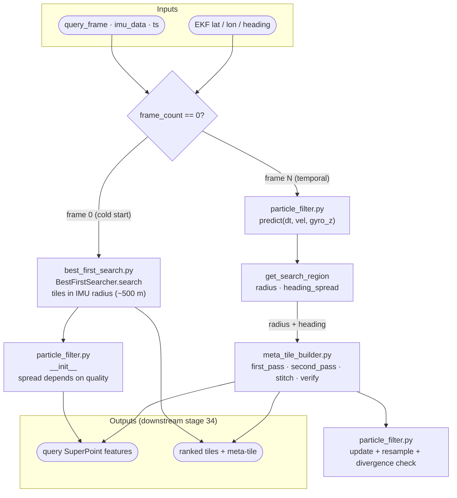
```mermaid
flowchart TD

    subgraph IN["Inputs"]
        IN_FRAME(["query_frame · imu_data · ts"])
        IN_EKF(["EKF lat / lon / heading"])
    end

    DISP{"frame_count == 0?"}

    BFS["best_first_search.py<br/>BestFirstSearcher.search<br/>tiles in IMU radius (~500 m)"]
    PF_INIT["particle_filter.py<br/>__init__<br/>spread depends on quality"]

    PF_PRED["particle_filter.py<br/>predict(dt, vel, gyro_z)"]
    REGION["get_search_region<br/>radius · heading_spread"]
    MTB["meta_tile_builder.py<br/>first_pass · second_pass · stitch · verify"]
    PF_UPD["particle_filter.py<br/>update + resample + divergence check"]

    subgraph OUT_GRP["Outputs (downstream stage 34)"]
        OUT_FEATS(["query SuperPoint features"])
        OUT_TILES(["ranked tiles + meta-tile"])
    end

    IN_FRAME --> DISP
    IN_EKF --> DISP
    DISP -->|"frame 0 (cold start)"| BFS
    BFS --> PF_INIT
    PF_INIT --> OUT_FEATS
    BFS --> OUT_TILES

    DISP -->|"frame N (temporal)"| PF_PRED
    PF_PRED --> REGION
    REGION -->|"radius + heading"| MTB
    MTB --> PF_UPD
    MTB --> OUT_FEATS
    MTB --> OUT_TILES
```

### §4.6  L3 — Visual matching pipeline

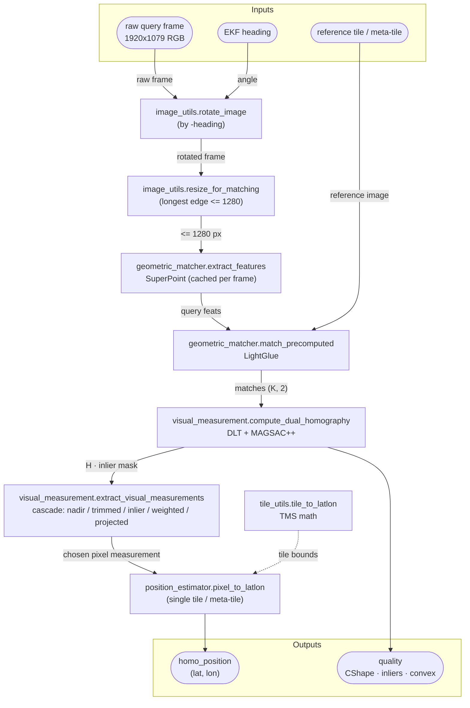
```mermaid
flowchart TD

    subgraph IN["Inputs"]
        Q_IN(["raw query frame<br/>1920x1079 RGB"])
        HDG_IN(["EKF heading"])
        TILES_IN(["reference tile / meta-tile"])
    end

    ROT["image_utils.rotate_image<br/>(by -heading)"]
    RM["image_utils.resize_for_matching<br/>(longest edge <= 1280)"]

    GM_E["geometric_matcher.extract_features<br/>SuperPoint (cached per frame)"]
    GM_M["geometric_matcher.match_precomputed<br/>LightGlue"]

    DH["visual_measurement.compute_dual_homography<br/>DLT + MAGSAC++"]
    EVM["visual_measurement.extract_visual_measurements<br/>cascade: nadir / trimmed / inlier / weighted / projected"]

    PE["position_estimator.pixel_to_latlon<br/>(single tile / meta-tile)"]
    TU["tile_utils.tile_to_latlon<br/>TMS math"]

    subgraph OUT_GRP["Outputs"]
        OUT_HOMO(["homo_position<br/>(lat, lon)"])
        OUT_QUAL(["quality<br/>CShape · inliers · convex"])
    end

    Q_IN -->|"raw frame"| ROT
    HDG_IN -->|"angle"| ROT
    ROT -->|"rotated frame"| RM
    RM -->|"<= 1280 px"| GM_E
    GM_E -->|"query feats"| GM_M
    TILES_IN -->|"reference image"| GM_M

    GM_M -->|"matches (K, 2)"| DH
    DH -->|"H · inlier mask"| EVM
    DH --> OUT_QUAL

    EVM -->|"chosen pixel measurement"| PE
    TU -.->|"tile bounds"| PE
    PE --> OUT_HOMO
```

### §4.7  L3 — Semantic gate

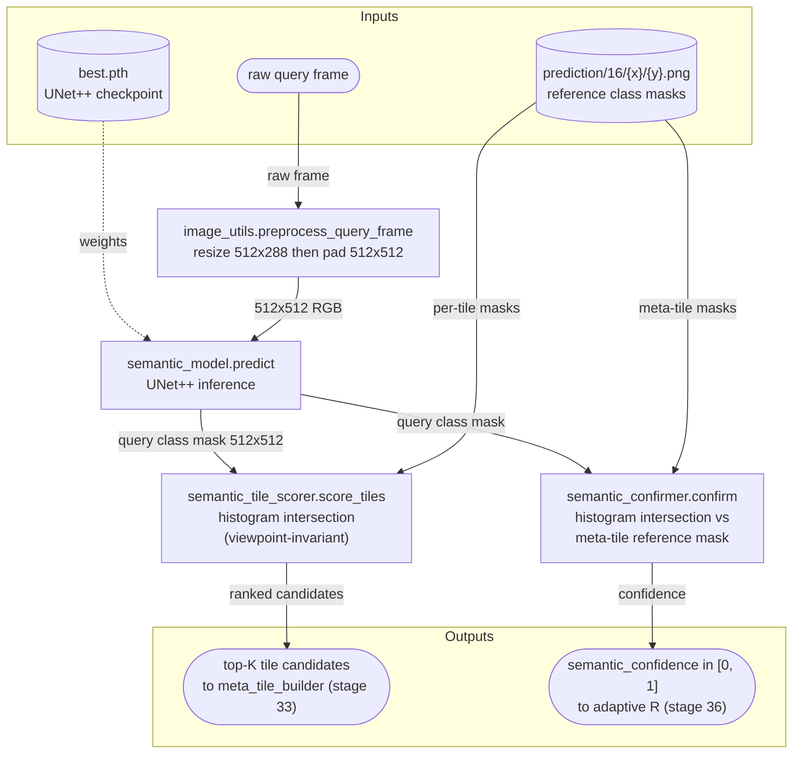
```mermaid
flowchart TD

    subgraph IN["Inputs"]
        Q_IN(["raw query frame"])
        REF_IN[("prediction/16/{x}/{y}.png<br/>reference class masks")]
        BPTH_IN[("best.pth<br/>UNet++ checkpoint")]
    end

    PP["image_utils.preprocess_query_frame<br/>resize 512x288 then pad 512x512"]
    SM["semantic_model.predict<br/>UNet++ inference"]

    SCORE["semantic_tile_scorer.score_tiles<br/>histogram intersection<br/>(viewpoint-invariant)"]
    CONF["semantic_confirmer.confirm<br/>histogram intersection vs<br/>meta-tile reference mask"]

    subgraph OUT_GRP["Outputs"]
        OUT_TOP(["top-K tile candidates<br/>to meta_tile_builder (stage 33)"])
        OUT_CONF(["semantic_confidence in [0, 1]<br/>to adaptive R (stage 36)"])
    end

    BPTH_IN -.->|"weights"| SM
    Q_IN -->|"raw frame"| PP
    PP -->|"512x512 RGB"| SM
    SM -->|"query class mask 512x512"| SCORE
    SM -->|"query class mask"| CONF
    REF_IN -->|"per-tile masks"| SCORE
    REF_IN -->|"meta-tile masks"| CONF

    SCORE -->|"ranked candidates"| OUT_TOP
    CONF -->|"confidence"| OUT_CONF
```

### §4.8  L3 — Quality gate, look-ahead, adaptive R, fusion, output

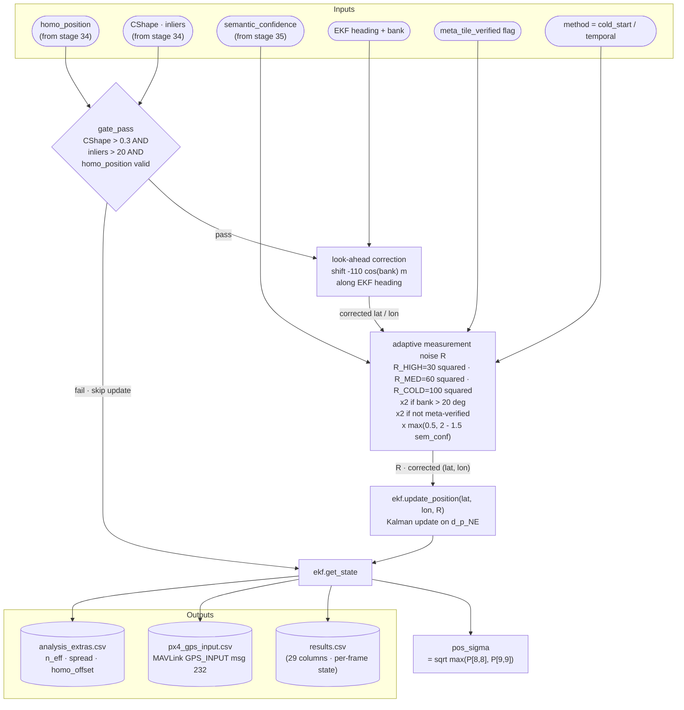
```mermaid
flowchart TD

    subgraph IN["Inputs"]
        HOMO_IN(["homo_position<br/>(from stage 34)"])
        QUAL_IN(["CShape · inliers<br/>(from stage 34)"])
        SEMC_IN(["semantic_confidence<br/>(from stage 35)"])
        EKF_IN(["EKF heading + bank"])
        META_V_IN(["meta_tile_verified flag"])
        METHOD_IN(["method = cold_start / temporal"])
    end

    GATE{"gate_pass<br/>CShape > 0.3 AND<br/>inliers > 20 AND<br/>homo_position valid"}

    LA["look-ahead correction<br/>shift -110 cos(bank) m<br/>along EKF heading"]

    AR["adaptive measurement noise R<br/>R_HIGH=30 squared · R_MED=60 squared · R_COLD=100 squared<br/>x2 if bank > 20 deg<br/>x2 if not meta-verified<br/>x max(0.5, 2 - 1.5 sem_conf)"]

    EKF_UPD["ekf.update_position(lat, lon, R)<br/>Kalman update on d_p_NE"]

    GET["ekf.get_state"]
    SIGMA["pos_sigma<br/>= sqrt max(P[8,8], P[9,9])"]

    subgraph OUT_GRP["Outputs"]
        CSV_OUT[("results.csv<br/>(29 columns · per-frame state)")]
        PX4_OUT[("px4_gps_input.csv<br/>MAVLink GPS_INPUT msg 232")]
        EXTRA_OUT[("analysis_extras.csv<br/>n_eff · spread · homo_offset")]
    end

    HOMO_IN --> GATE
    QUAL_IN --> GATE

    GATE -->|"pass"| LA
    EKF_IN --> LA
    LA -->|"corrected lat / lon"| AR
    SEMC_IN --> AR
    META_V_IN --> AR
    METHOD_IN --> AR

    AR -->|"R · corrected (lat, lon)"| EKF_UPD
    EKF_UPD --> GET
    GATE -->|"fail · skip update"| GET
    GET --> SIGMA

    GET --> CSV_OUT
    GET --> PX4_OUT
    GET --> EXTRA_OUT
```

---

## §5  Cross-component artefact reference

| Artefact | Produced by | Consumed by |
|---|---|---|
| `aerial/16/{x}/{y}.png` | QGIS workflow | `Dataset_Preprocessing/{semantic,superpoint}_preprocessor.py`, `SeasonCurriculumDataset`, `Pipeline_3_Rev1/src/tile_utils.py` |
| `mask/16/{x}/{y}.png` | QGIS workflow | `SeasonCurriculumDataset` → `encode_mask_rgb` |
| `tile_index.csv` | QGIS / preprocessing helper | `SeasonCurriculumDataset` |
| `best.pth` (UNet++ checkpoint) | `Semantic_Model_QGIS_8_Class_Rev6.ipynb` | `Dataset_Preprocessing/semantic_preprocessor.py`, `Pipeline_3_Rev1/src/semantic_model.py` |
| `prediction/16/{x}/{y}.png` | `Dataset_Preprocessing/semantic_preprocessor.py` | `Pipeline_3_Rev1/src/semantic_tile_scorer.py`, `semantic_confirmer.py` |
| `reference_features.h5` | `Dataset_Preprocessing/superpoint_preprocessor.py` → `feature_store.py` | `Pipeline_3_Rev1` runtime via `FeatureStoreLoader` → `MetaTileBuilder` / `BestFirstSearcher` |
| Initial GPS prior  *(one-shot)* | MSFS / `SimConnectLiveSource` or row 0 of recorded CSV | `Pipeline_3_Rev1/runtime/run_pipeline.py::_init_ekf` |
| IMU stream | MSFS / `simconnect_adapter.py` | `step_ekf`, `TemporalSearcher` |
| Camera frame | MSFS / `simconnect_adapter.py` | `TemporalSearcher.process_frame` |
| `results.csv` (29 cols) | `Pipeline_3_Rev1/runtime/run_pipeline.py` | Downstream evaluation, thesis figures |
| PX4 `GPS_INPUT` (MAVLink 232) | `Pipeline_3_Rev1/runtime/run_pipeline.py` (optional) | PX4 autopilot / SITL |
